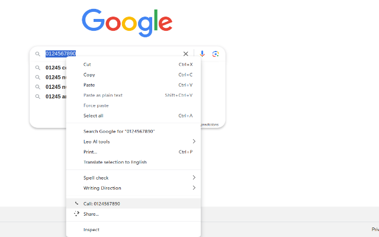
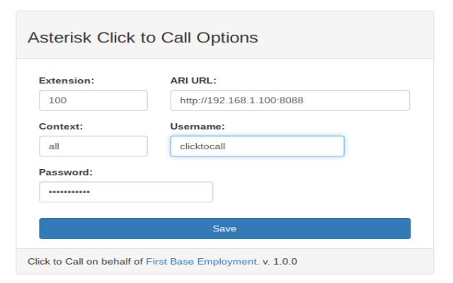

# Asterisk Click To Call (Manifest V3)

This is a Manifest V3 version of a basic Asterisk Click To Call extension. I looked at the defunct Bitree Click2Call extension to see how to build a proper URL. Unlike that one, this extension does not track or record any user behaviour. This extension is for Asterisk using AMI only (Asterisk v12 or higher).

This extension would generally be used if you are working in an office that already uses an Asterisk PBX and you want to improve your workflow to quickly dial out from your browser. Note you'll have to enable some features in Asterisk, so you will need admin access to Asterisk. 

[Get it on the Chrome Web Store](https://chromewebstore.google.com/detail/asterisk-click-to-call/pioibldicnmheenkadiijicefnalndli)

## Overview

This extension allows you to right-click on a highlighted phone number on a webpage and via the context menu have Asterisk place a call via a callback mechanism. The extension constructs a URL based on settings saved in Chrome Storage, and the URL follows the format required by Asterisk’s ARI interface.



## Click2Call Callback URL Format

The extension builds the following URL format to initiate a call, you can prove it's working without the extension by using curl to replicate the callback request:

```bash
curl -v -X POST "http://192.168.0.1:8088/ari/channels?endpoint=Local/999@all&extension=01234567890&callerId=01234567890&timeout=15&context=all&api_key=clicktocall:clicktocall_secret"
```
## URL Parameters Explained

- **endpoint:** `Local/999@all`  
  The local channel for the outbound call. Replace `999` with your extension.
- **extension:**  
  The phone number to dial (e.g., `01234567890`).
- **callerId:**  
  The number that will be displayed as the caller ID.
- **timeout:**  
  The call timeout in seconds.
- **context:**  
  The dialplan context (e.g., `all`).
- **api_key:**  
  The manager username and secret combined (e.g., `clicktocall:clicktocall_secret`).

## Asterisk Configuration

For this extension to work, update your Asterisk configuration as follows:

1. **Asterisk Version**  
   Ensure you are using **Asterisk version 12 or higher** with AMI support.

2. **ARI Configuration**  
   Add the following entry to your `/etc/asterisk/ari.conf`:

   ```ini
   [general]
   enabled = yes
   pretty = no
   allowed_origins = * ; you can lock down permitted sources
   
   [clicktocall]
   type = user
   read_only = no
   password = clicktocall_secret
   password_format = plain   ;  crypted or plaintext
   ```
This username and password will be what you configure in the chrome extension.



   ### 3. Enable Mini HTTP Server

Enable the mini HTTP server in Asterisk by updating your `http.conf` with the following settings:

```ini
 [general]
 enabled=yes
 bindaddr=192.168.1.100
 bindport=8088
; Optional: enable TLS/SSL if you use secure HTTPS connections
; tlsenable=yes
; tlsbindaddr=0.0.0.0:8089
  ```

## Installation

1. **Clone or Download the Repository**  
   Clone the repository or download the source code to your local machine.

2. **Load the Extension into Chrome**  
   - For development, open Chrome and navigate to `chrome://extensions/`.
   - Enable "Developer mode" by toggling the switch in the top-right corner.
   - Click on "Load unpacked" and select your extension’s folder.
   - Alternatively, you can [get it on the Chrome Web Store](https://chromewebstore.google.com/detail/asterisk-click-to-call/pioibldicnmheenkadiijicefnalndli)

3. **Configure the Extension Options**  
   - Open the extension’s options page.
   - Enter your Asterisk settings (IP, extension, username, secret, context, etc.) as required.
   - Click "Save" to store your configuration.

4. **Test the Extension**  
   - Visit any webpage, highlight a phone number, right-click, and choose the context menu option to initiate a call.
   - Verify that the call is placed as expected.
  
   
## Debugging

If you need to debug the extension, use the browser console. 

#### Checking Saved Credentials

you can check these are entered correctly :

1. **Open Developer Tools**: Press F12 or right-click on the page and select **Inspect**.
2. **Navigate to the Console**: Go to the **Console** tab.

Then, run the following command in the Console:

```javascript
chrome.storage.sync.get(["username", "secret", "ip", "exten"], function(result) {
  console.log("Saved credentials:", result);
});
```

#### Check the Extension Error Log

1. **Open the Extensions Page**:  
   Navigate to the extensions page in your Chrome/Chromium/Brave/Edge/etc browser.

2. **Enable Developer Mode**:  
   In the top-right corner of the Extensions page, toggle the **Developer mode** switch on.

3. **Select the Extension**:  
   Find the extension in the list of installed extensions.

4. **View the Error Log**:  
   - An **Errors** button or link will show — click it to view the error details.  


